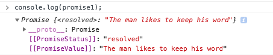
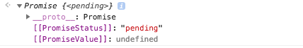
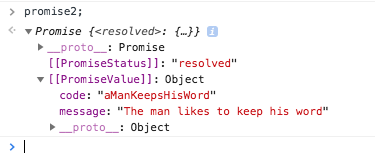
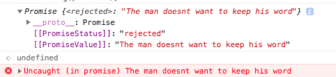
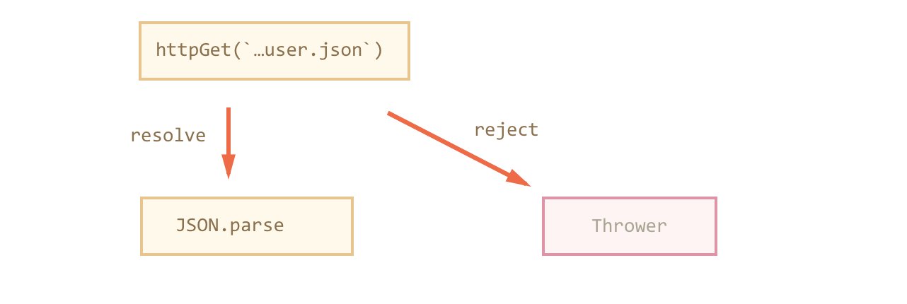

# Promise

Promise-объекты в программировании, которые мы называем «промисами», очень похожи на обычные обещания, которые люди дают друг другу в реальной жизни.

Для того чтобы понять промисы, надо разобраться с двумя основными вещами. **Первая** — это создание промисов. **Вторая** — обработка результатов, возвращаемых промисами.


### Create Promise

```text
new Promise( /* executor */ function(resolve, reject) { ... } );
```

Конструктор принимает функцию, выполняющую некие действия, мы назвали её здесь `executor`. Эта функция принимает два параметра — `resolve` и `reject`, которые, в свою очередь, также являются функциями. Промисы обычно используются для выполнения асинхронных операций или кода, который может заблокировать главный поток, например — такого, который работает с файлами, выполняет вызовы неких API, делает запросы к базам данных, занимается операциями ввода-вывода, и так далее. Запуск подобных асинхронных операций выполняется в функции `executor`. Если асинхронная операция будет завершена успешно, тогда результат, ожидаемый от промиса, будет возвращён путём вызова функции `resolve`. Ситуация, в которой вызывается эта функция, определяется создателем промиса. Аналогично, при возникновении ошибки, сведения о том, что случилось, возвращают, вызывая функцию `reject`.

```text
var keepsHisWord;
keepsHisWord = true;
promise1 = new Promise(function(resolve, reject) {
  if (keepsHisWord) {
    resolve("The man likes to keep his word");
  } else {
    reject("The man doesnt want to keep his word");
  }
});
console.log(promise1);
```

Вот что выведет этот код:



Так как наш промис мгновенно разрешается, исследовать его начальное состояние мы не можем. Поэтому давайте создадим новый промис, прибегнув к функции `setTimeout`

```text
promise2 = new Promise(function(resolve, reject) {
  setTimeout(function() {
    resolve({
      message: "The man likes to keep his word",
      code: "aManKeepsHisWord"
    });
  }, 10 * 1000);
});
console.log(promise2);
```

В этом коде создаётся промис, который безусловно разрешится через 10 секунд. Это даёт нам возможность взглянуть на состояние неразрешённого промиса.



После того, как пройдут 10 секунд, промис будет разрешён. В результате и `PromiseStatus`, и `PromiseValue` будут соответствующим образом обновлены. 



Взглянем теперь на промис, который мы решили не разрешить, а отклонить. Для этого модифицируем тот код, который уже использовался в первом примере.

```text
keepsHisWord = false;
promise3 = new Promise(function(resolve, reject) {
  if (keepsHisWord) {
    resolve("The man likes to keep his word");
  } else {
    reject("The man doesn't want to keep his word");
  }
});
console.log(promise3);
```



Теперь, проанализировав все три примера, мы можем видеть, что в `PromiseStatus` могут появляться три разных значения: `pending` \(ожидание\), `resolved` \(успешное разрешение\) и `rejected` \(отклонение\). Когда промис создаётся, в `PromiseStatus` будет значение `pending`, а в `PromiseValue` будет `undefined`. Эти значения будут сохраняться до разрешения или отклонения промиса. Когда промис находится в состоянии `resolved` или `rejected`, его называют заданным \(`settled`\) промисом. Такой промис перешёл из состояния ожидания в состояние, в котором он имеет либо состояние `resolved`, либо состояние `rejected`.

`Promise.reject()`, однако, рекомендуется всегда передавать этому методу объект `Error`.  


### Object Promise

> У объекта `Promise` есть статические методы и методы прототипа объекта. Статические методы можно вызывать, не создавая экземпляр объекта, а для вызова методов прототипа нужен экземпляр объекта `Promise`. Учитывайте, что и статические и обычные методы возвращают объекты `Promise`. Это упрощает работу.

#### Методы прототипа объекта Promise

Как мы уже видели, когда промис создаётся, он находится в состоянии `pending`. При переходе промиса в состояние `resolved` или `rejected` будет вызван, как минимум, один из следующих методов:

```text
Promise.prototype.catch(onRejected)
Promise.prototype.then(onFulfilled, onRejected)
Promise.prototype.finally(onFinally)
```

#### Статические методы объекта Promise

два метода — `Promise.reject(reason)`и `Promise.resolve(value)`, которые позволяют создавать, соответственно, отклонённые и разрешённые промисы.

два метода, `Promise.all` и `Promise.race`, предназначены для работы с наборами промисов.

Вызов `Promise.all(iterable)` получает массив \(или другой итерируемый объект\) промисов и возвращает промис, который ждёт, пока все переданные промисы завершатся, и переходит в состояние «выполнено» с массивом их результатов т.е. параллельное выполнение\).

```text
Promise.all([
  httpGet('/article/promise/user.json'),
  httpGet('/article/promise/guest.json')
]).then(results => {
  alert(results);
});
```

Заметим, что если какой-то из промисов завершился с ошибкой, то результатом `Promise.all` будет эта ошибка. При этом остальные промисы игнорируются.

Вызов `Promise.race`, в отличие от `Promise.all`, результатом будет только первый успешно выполнившийся промис из списка. Остальные игнорируются.


### Patterns Promise

Последовательное выполнение промисов

```text
let itemIDs = [1, 2, 3, 4, 5];

itemIDs.reduce((promise, itemID) => {
  return promise.then(_ => api.deleteItem(itemID));
}, Promise.resolve());
```


### Example Promise

```text
httpGet('/article/promise/user.json')
  .then(JSON.parse)
```



Если промис завершился через `resolve`, то результат – в `JSON.parse`, если `reject` – то в Thrower.

`Thrower` – это стандартная внутренняя функция, которая автоматически используется, если второй обработчик не указан \(например err =&gt; throw err в примере ниже\).

```text
httpGet('/article/promise/user.json')
  .then(JSON.parse, err => throw err)
```

Заметим, что когда обработчик в промисах делает `throw` – в данном случае, при ошибке запроса, то такая ошибка не «валит» скрипт и не выводится в консоли. Она просто будет передана в ближайший следующий обработчик `onRejected`.

