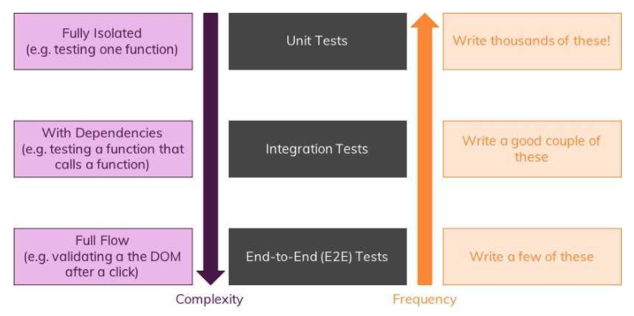

# React Testing

### Reasons for testing

Why would it be a good idea to write automated tests? There are many reasons; here are some of our reasons:

* To find bugs.
* To ensure that your app will work as intended for your end users \(dangerous refactor\).
* To make your app more robust and less error prone.
* To keep tests as living documentations.

### Types of testing

* **Unit tests** that test one isolated unit/ piece of code \(e.g. a function\)

Unit tests are the easiest tests to write because you have some input and can expect some result. There are no dependencies, no complex interactions.


* **Integration tests** which test the combination of features \(e.g. a function calling another function\)

Integration tests are a bit more complex than unit tests because you now have to deal with some dependencies \(e.g. another function that gets called\).


* **End-to-End \(e2e\) or UI tests** which test a full interaction path in your app \(e.g. the signup process\)

These kind of tests have a different level of complexity to write them and a different frequency.



### Tools for Testing

There are several [Tools and Libraries for Testing in React](https://blog.bitsrc.io/7-react-testing-libraries-you-should-know-b20ca97422a4).

create-react-app comes with [Jest](https://facebook.github.io/jest/) pre-configured. Jest is the test runner and testing framework used by React. Jest is the environment where all your tests are actually executed.

But there are a few great libraries you'll want to add. The libraries you'll want are:

* [enzyme](http://airbnb.io/enzyme/): Made by AirBnb, specifically made to help test React components
* [enzyme-adapter-react-16](https://www.npmjs.com/package/enzyme-adapter-react-16): Needed to have enzyme work with your version of React
* [enzyme-to-json](https://www.npmjs.com/package/enzyme-to-json): Let's you customize how Jest serializes snapshots.
* ...

### Config

If your app uses a browser API that you need to mock in your tests or if you need a global setup before running your tests, add a `src/setupTests.js` to your project. It will be automatically executed before running your tests.

```javascript
import { configure } from "enzyme";
import Adapter from "enzyme-adapter-react-16";

configure({ adapter: new Adapter() });
```

We import our Adapter to make enzyme work with react 16 and initialize it as shown above.

And you should manually create the property `setupFilesAfterEnv` in the configuration for Jest into package.json file \([read here](https://create-react-app.dev/docs/running-tests/#initializing-test-environment)\), something like the following:

```text
"jest": {  // ...  "setupFilesAfterEnv": ["<rootDir>/src/setupTests.js"] }
```

### File Structure


### Writing Tests

```javascript
// utils.js

export const sum = (a, b) => {
  return a + b;
};
```

```javascript
// utils.test.js

import { sum } from "./utils";

describe('Testing sum', () => {

    it('should equal 4',()=>{
       expect(sum(2,2)).toBe(4);
      })

    test('also should equal 4', () => {
        expect(sum(2,2)).toBe(4);
      }) 
});
```

`describe` wraps our `it` or `test` blocks, and is a way to group our tests. Both `it` and `test` are keywords and can be used interchangeably. The string will be something that should happen with your tests and will be printed to the console. Jest provides a built-in [`expect()`](https://jestjs.io/docs/en/expect) global function for making assertions.`toBe()` is a matcher that works with expect to allow you to make assertions. There are many more [matchers](https://jestjs.io/docs/en/using-matchers) and [global variables](https://jestjs.io/docs/en/api) offered by jest.

### SnapShot Testing

Here is our basic component we are snapshot testing:

```javascript
// Basic.js

import React from "react";

const Basic = () => {
  return (
    <div>
      <h1> Basic Test </h1>
      <p> This is a basic Test Component</p>
    </div>
  );
};

export default Basic;
```

```javascript
// Basic.test.js
// test which is a snapshot test

import React from "react";
import { shallow } from "enzyme";
import toJson from "enzyme-to-json";

import Basic from "./Basic";

describe("snapshot", () => {
  it("renders correctly", () => {
    const wrapper = shallow(<Basic />);

    expect(toJson(wrapper)).toMatchSnapshot();
  });
});
```

Import the [`shallow`](https://enzymejs.github.io/enzyme/docs/api/ShallowWrapper/shallow.html) function from the `enzyme` library. Shallow renders the root node and returns a shallow wrapper around it.

Import the `toJson` function from the [`enzyme-to-json`](https://www.npmjs.com/package/enzyme-to-json) library. It will need this to convert our shallow rendered component into JSON which can be saved to the snapshot file

If we'll ran the command yarn test, a `__snapshots__` folder and `basic.test.js.snap` file will be created for you automatically. On every subsequent test the new snapshot will be compared to the existing snapshot file. The test will pass if the snapshot has not changed and fail if it has changed.

Running the above test will generate a file that will look like this. This is essentially our tree of React DOM nodes.

```javascript
// Jest Snapshot v1, https://goo.gl/fbAQLP

exports[`snapshot renders correctly 1`] = `
<div>
  <h1>
     Basic Test 
  </h1>
  <p>
     This is a basic Test Component
  </p>
</div>
`;
```

However, what happens if we changed our basic component, for example, we deleted paragraph

```javascript
// Basic.js

import React from "react";

const Basic = () => {
  return (
    <div>
      <h1> Basic Test </h1>
    </div>
  );
};

export default Basic;
```

Our snapshots will fail


If we want to update our snapshot we'll just need to press "w" to activate watch mode then press "u" to update the snapshot. So our snapshot file will be automatically updated with the new snapshot and will pass our tests. 

```javascript
// Jest Snapshot v1, https://goo.gl/fbAQLP

exports[`snapshot renders correctly 1`] = `
<div>
  <h1>
     Basic Test 
  </h1>
</div>
`;
```


## Useful links

1. [Автотесты. Модульное тестирование;](https://www.youtube.com/watch?v=qaL70WegmaI)
2. [Интеграционное тестирование интерфейсов](https://www.youtube.com/watch?v=dflmpqh_oRc);
3. 
