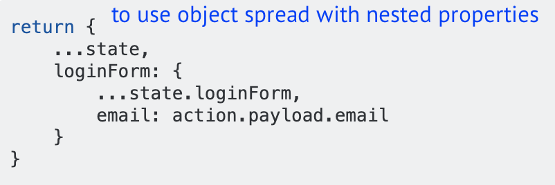

# Core JS

## Timeline


## Operator Rest & Spread

### Copy an array

```text
var arr = [1, 2, 3, 4, 5];
var data = [...arr];
console.log(data); // [1, 2, 3, 4, 5]
```

### Create a new array

```text
const parts = ['shoulders', 'knees']; 
const lyrics = ['head', ...parts, 'and', 'toes']; 
//  ["head", "shoulders", "knees", "and", "toes"]
```

**Concatenate arrays**

```text
let arr1 = [0, 1, 2];
let arr2 = [3, 4, 5];

arr1 = [...arr1, ...arr2]; 
//  arr1 is now [0, 1, 2, 3, 4, 5]
```

### Spread operator deep copy



