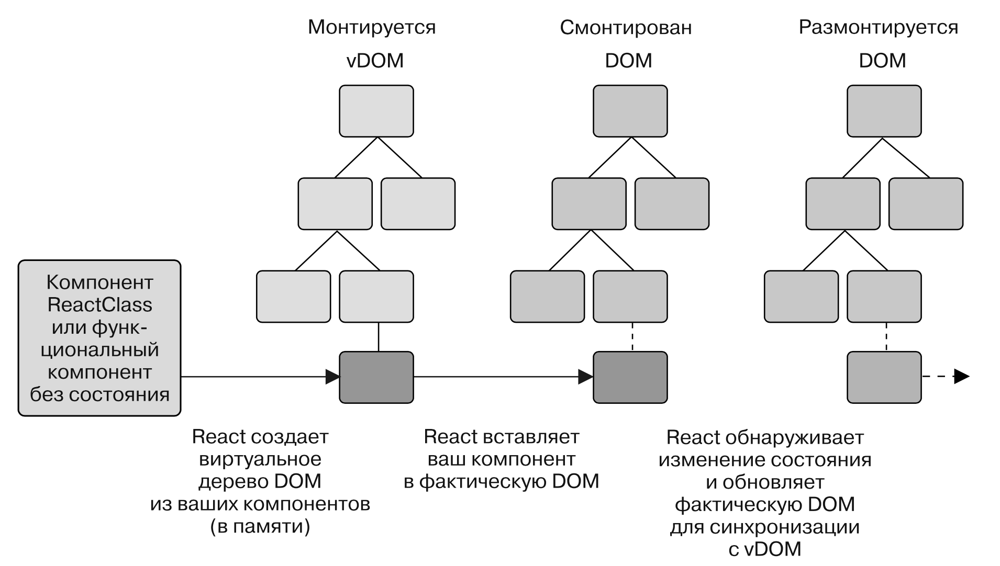
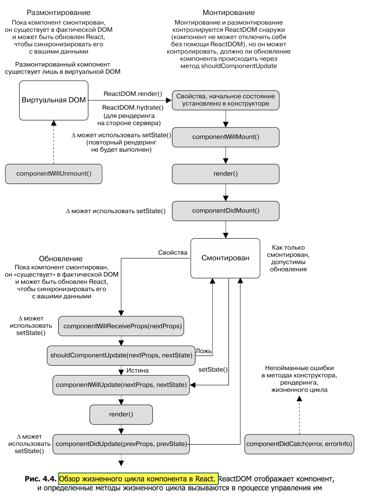
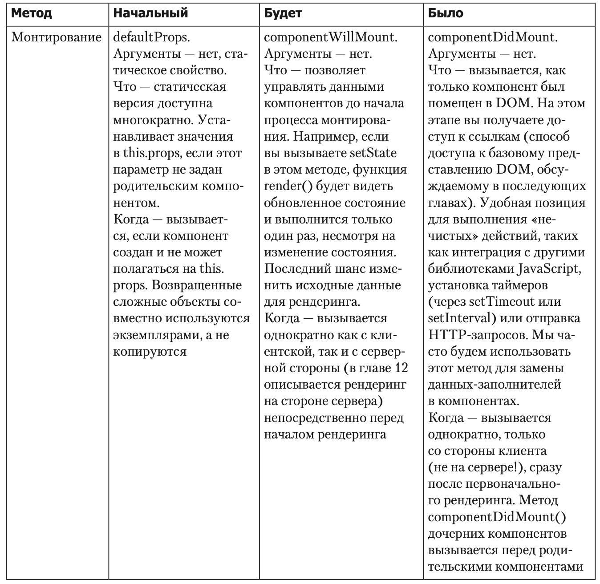
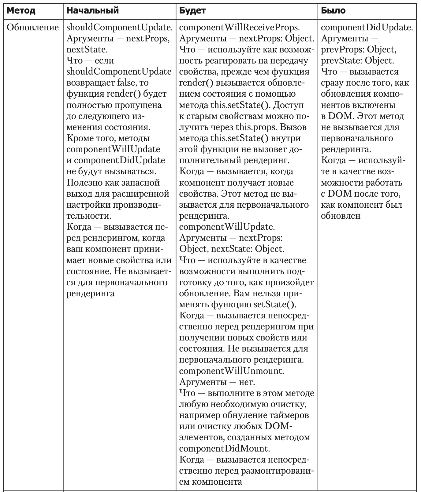
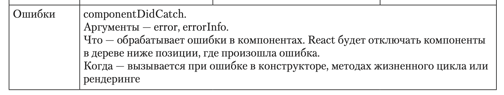
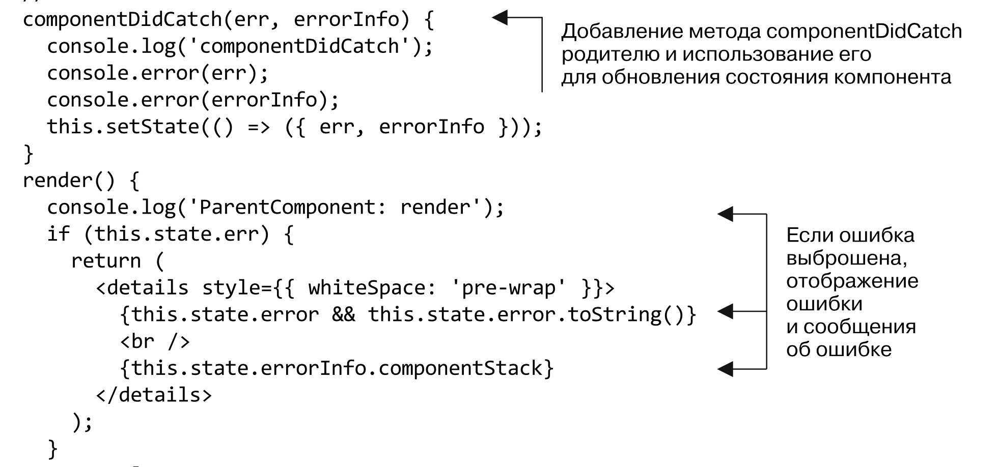

# Common notes

**React** -  _это декларативная, основанная на компонентах библиотека для создания пользовательских интерфейсов, поддерживаемая на различных устройствах._

Разработчик объявляет, как компоненты должны вести себя  и выглядеть в разных состояниях, а внутренний механизм React справляется со сложностями управления обновлениями, апгрейдом пользовательского интерфейса для отображения изменений и т.д.

Библиотека React _рекурсивна_ в том, как она формирует дерево и рендерит объекты, — она всесторонне изучает все части ваших компонентов, спрашивая о каждом из них и обо всех их дочерних элементах.

## Состояние

**Состояние** — вся информация, к которой программа имеет доступ в данный момент времени.

В React они известны как состояние \(данные, которые можно изменить внутри компонента\) и свойства \(получаемые компонентом данные, которые он не должен изменять\).

setState - способ изменения динамического состояния в компонентах React

```text
setState( updater,
[callback] ) -> void
```

Интерфейс setState использует функцию, предназначенную для установки нового состояния компонента и дополнительной функции callback. Функция updater имеет следующий синтаксис:

```text
(prevState, props) => stateChange
```

Интерфейс setState выполняет мелкое слияние данных и обновляет состояние компонента, сохраняя любые свойства верхнего уровня, которые не перезаписываются.

Данные передаются в обратном направлении, от родителей потомкам. Потомки могут возвращать данные родителям через обратный вызов, но не могут напрямую изменять состояние родителя, и родитель не может напрямую изменять состояние потомка. Вместо этого взаимодействие компонентов выполняется через свойства.

**defaultProps** — статическое свойство, которое определяет свойства по умолча- нию для компонента. 

**state \(**начальное\) — значение этого свойства в конструкторе будет начальным, заданным для определения состояния вашего компонента.

## Рендеринг и методы жизненного цикла в React

Компоненты React создаются из классов JavaScript, которые наследуются от класса React.Component и имеют жизненный цикл, к которому вы можете подключиться. Это означает, что у них есть начало, середина и конец времени существования, которым управляет React. Поскольку они наследуются от абстрактного базового класса React.Component, то имеют доступ к специальным API React, чего нет у функциональных компонентов без состояния.

React обеспечивает методы жизненного цикла, с помощью которых можно подключаться к различным частям жизни компонента. Это позволяет приложению действовать надлежащим образом в разных частях процесса React, управляющего пользовательским интерфейсом. Не все методы жизненного цикла следует при- менять, их нужно вводить только в случае необходимости. Во многих случаях все, что вам нужно, — это функциональный компонент без состояния.

React предоставляет метод обработки ошибок, которые возникают в конструкторе, в процессе рендеринга или в методах жизненного цикла компонента — componentDidCatch. С его помощью задают границы ошибок в приложении. Это подобно конструкции try...catch в языке JavaScript. Если React обнаруживает ошибку, он размонтирует компонент, в котором она произошла, и его потомков из DOM, чтобы повысить стабильность рендеринга и предотвратить сбой всего приложения.

### **Методы жизненного цикла**

**Методы жизненного цикла** — это специальные методы, связанные с компонентами, основанными на классе React, которые будут выполняться в определенных точках жизненного цикла компонента. Жизненный цикл — это способ отразить процесс существования компонента. _Основными частями жизни_ компонента React являются монтирование, обновление и размонтирование.

* инициализация — при создании экземпляра класса компонента;
* монтирование — компонент вставляется в DOM;
* обновление — компонент обновляется новыми данными через состояние или свойства;
* размонтирование — компонент удаляется из DOM.





#### Сводка методов жизненного цикла компонента React








### **Монтирование**

**Монтирование** — это процесс React, помещающий компоненты в фактическую DOM. После этого компонент «готов» и, как правило, наступает самое время выполнять HTTP-вызовы или чтение cookie-файлов. На этом этапе вы также можете получить доступ к DOM-элементу через функцию ref


функцию **componentWillMount,** которая позволяет установить состояние или выполнить другие действия перед монтированием компонентов. Любые изменения состояния внутри этого метода не будут запускать повторный рендеринг, в отличие от других обновлений состояния, которые инициируют процесс обновления, рассмотренный ранее.

componentDidMount. Когда React вызывает этот метод, у вас есть возможность использовать его, а также получить доступ к ссылкам на компоненты. В этом методе у вас есть доступ к состоянию и свойствам компонентов, также вы узнаете, что компонент готов к обновлению. Теперь можно обновить его с помощью данных, возвращаемых в результате сетевого запроса. Отличный вариант для работы со сторонними библиотеками, зависимыми от DOM

### Размонтирование

Размонтирование — это процесс удаления компонента из DOM.

Независимо от действия пользуйтесь методом componentWillUnmount, чтобы выполнить любую очистку, необходимую для удаления компонента.

### Обработка ошибок

Метод componentDidCatch предоставляет доступ к выброшенной ошибке и сообщению об ошибке. Используя их, вы обеспечите правильное реагирование компонентов на ошибки. В более сложном приложении этот метод можно применять для настройки состояния ошибки для отдельных компонентов \(например, виджета, карты или другого компонента\) или на уровне приложения. 




## Тестирование компонентов

### Tипы тестирования

**Блочное тестирование** — тесты блоков сосредоточены на отдельных единицах функциональности. Например, у вас есть метод утилиты для получения новых сообщений с сервера. Блочный тест будет сосредоточен лишь на одной функции — ничто другое его не волнует. Подобно компонентам, такие тесты позволяют проводить реорганизацию и повышать модульность.

**Тестирование сервисов** — данное тестирование сосредоточено на наборах функциональности. Эта часть спектра тестов может включать в себя множество дробных частей и фокусов. Дело в том, что вы тестируете код, который находится не на самом высоком или самом низком уровне функциональности. Пример сервисного теста может быть чем-то вроде инструмента, который использует несколько единиц функциональности, но сам находится не на уровне теста интеграции.

**Тестирование интеграции** — сосредоточено на еще более высоком уровне тестирования — интеграции различных частей приложения. Такие тесты проверяют, как работают совместно сервисы и функции более низкого уровня. Как правило, эти тесты работают с приложением через его пользовательский интерфейс, а не через отдельный код, стоящий за ним. Они могут имитировать щелчки кнопкой мыши, пользовательский ввод и другие взаимодействия, которые управляют приложением.‰

‰‰

